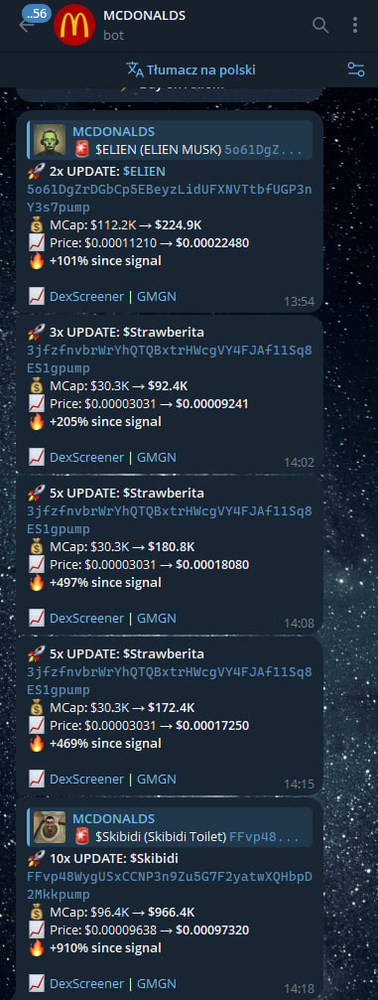

# Signal Terminal


> Real-time Solana pump.fun signal bot — KOL wallet tracking, volume spike detection, Telegram alerts.

## What is it

Signal Terminal is an async Python bot that monitors new tokens created on pump.fun in real time via WebSocket. Every new token is automatically scored based on: rug check, holder concentration, KOL wallet activity, and volume. Tokens with a score above the threshold are delivered as signals to a Telegram channel with a full briefing (market cap, score, links to DexScreener and Birdeye).

## Features

- **Real-time WebSocket** — PumpPortal `wss://pumpportal.fun/api/data`, low latency on new token events
- **Scoring engine** — multi-factor scoring: rug check (RugCheck.xyz), holder concentration (Helius RPC), market cap, initial buy
- **KOL Wallet Tracker** — tracks known smart money wallets, score bonus when a KOL buys
- **Smart Money Tracker** — analyzes token creator wallet profit history
- **Volume Spike Detector** — detects sudden volume surges after graduation on Raydium/PumpSwap before significant volume spikes
- **Migration monitoring** — tracks tokens reaching $69K mcap and migrating to Raydium
- **Telegram signals** — formatted alerts with inline buttons (DexScreener, Birdeye, pump.fun)
- **SQLite persistence** — token history, signals, scan statistics (aiosqlite)
- **Dashboard** — local web UI with bot statistics and signal history
- **Auto-reconnect** — WebSocket with exponential backoff on disconnect

## Stack

| Layer | Technology |
|-------|-----------|
| Runtime | Python 3.11+ |
| Telegram | python-telegram-bot v21+ (async Application API) |
| WebSocket | websockets + aiohttp |
| Database | SQLite (aiosqlite) |
| HTTP | aiohttp (async) |
| Data | PumpPortal WS, DexScreener API, RugCheck API, Helius RPC |
| Deploy | Linux daemon (systemd / screen) |

## Architecture

```
signal-terminal/
├── src/
│   ├── bot.py          # Telegram bot, signal delivery, commands
│   ├── scanner.py      # Orchestrator: WebSocket -> enrich -> score -> signal
│   ├── scorer.py       # Multi-factor scoring engine
│   ├── kol_tracker.py  # KOL wallet tracking
│   ├── smart_money.py  # Token creator wallet history analysis
│   ├── volume_spike.py # Post-graduation spike detection
│   ├── rugcheck.py     # RugCheck.xyz client
│   ├── dexscreener.py  # DexScreener API client
│   ├── helius.py       # Helius RPC client
│   └── db.py           # SQLite persistence
├── run_v2.py           # Entry point
└── dashboard/          # Local web UI
```

## Status

Live — [@SignalTerminalBot](https://t.me/SignalTerminalBot)

---
Built by [Emil Piński](https://emilpinski.pl)

> Source code is private. [Contact for collaboration](mailto:emilpinskidev@gmail.com)

## Screenshots


